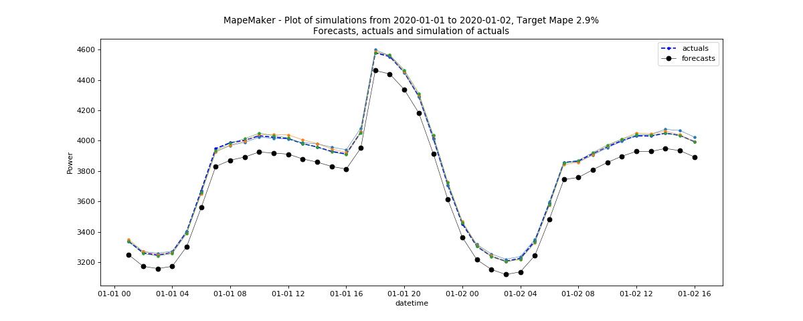

Demand data file examples
=======================

The following command will take the data based on rts gmlc's Load time series and launch the simulations with n = 3 and seed = 1234 from forecasts to actuals using an ARMA
Base Process. It will simulate all the dates in the input files. Finally, it will return a
plot of simulations, and create an output dir called "load_actuals_ARMA".

::

    python -m mape_maker "mape_maker/samples/based_rts_gmlc/Load_rts_gmlc_based/processed_file.csv" -st "actuals" -n 3 -bp "ARMA" -o "load_actuals_ARMA" -s 1234

* **"mape_maker/samples/based_rts_gmlc/Load_rts_gmlc_based/processed_file.csv"**:
 The csv file containing forecasts and actuals for specified datetimes.
* **-st "actuals"**:
 Set up the the target of the simulation as "actuals". So the MapeMaker will simulate the "actuals" data
 according to the "forecasts" data in the input file.
* **-n 3**:
 The number of simulations that we want to create is "3". This will create three simulation columns in the output file.
* **-bp "ARMA"**:
 Use "ARMA" as the base process. The default base process is set as "ARMA".
* **-o "load_actuals_ARMA"**:
 Create an output directory called "load_actuals_ARMA", in which will store the simulation output file.
* **-s 1234**:
 Set the seed as "1234", so it won't randomly choose a number as the seed.

After running the command line, you should see a similar plot like this:

Since rts_gmlc Load data has very little relative error and hence very little mape,
the scenario lines tend to overlap in the plot.