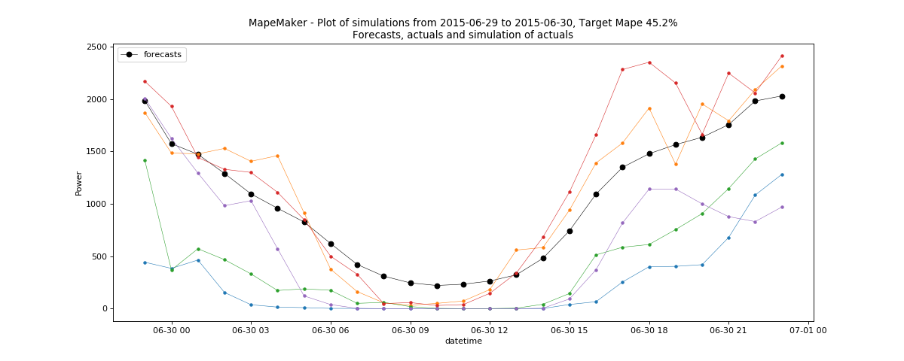

Operational Example
===================

**CAISO Wind Operations Examples**
---------------------------------

The following command will take the data from *CAISO_wind_operational_data.csv.csv*, which is a modified version of
CAISO's *wind_total_forecast_actual_070113_063015.csv*. We will find the scenarios from forecasts to actuals for the date(s) that have missing actuals.

It will simulate all the dates in the input files, and can use the date(s) with missing actuals for simulation dates.
In order to fit the process well, we need to simulate for a few additional hours before the day
we are interested in as the ARMA process can be a little imprecise for the first few hours.
For convenience/efficiency, we will add the preceding day to the desired simulation start date.
Here, for example, we are interested in 2015-6-30, but we will use 2015-6-29 as the simulation start date.
Finally, it will return a plot of simulations, and create an output dir called "Wind_Operation1".

::

    python -m mape_maker -xf "mape_maker/samples/CAISO_wind_operational_data.csv" -s 1234 -n 5 -bp "ARMA" -o "Wind_Operation1" -is "2013-7-1 00:00:00" -ie "2015-6-30 23:00:00" -ss "2015-6-29 23:00:00" -se "2015-6-30 23:00:00"

* **-xf "mape_maker/samples/CAISO_wind_operational_data.csv"**:
 The csv file containing forecasts and actuals for specified datetimes.
* **-n 5**:
 The number of simulations that we want to create is "3". This will create three simulation columns in the output file.
* **-bp "ARMA"**:
 Use "ARMA" as the base process. The default base process is set as "ARMA".
* **-is "2013-7-1 00:00:00"**:
 The start date for the computation of the distributions is "2013-7-1 00:00:00"
* **-ie "2015-6-30 23:00:00"**:
 The end date for the computation of the distributions is "2015-6-30 23:00:00"
* **-ss "2015-6-29 23:00:00"**:
 The start date of the simulation is "2015-6-29 23:00:00"
* **-se "2015-6-30 23:00:00"**:
 The end date of the simulation is ""2015-6-30 23:00:00"
* **-o "Wind_Operation1"**:
 Create an output directory called "Wind_Operation1", in which will store the simulation output file.
* **-s 1234**:
 Set the seed as "1234", so it won't randomly choose a number as the seed.

After running the command line, you should see a similar plot like this:

