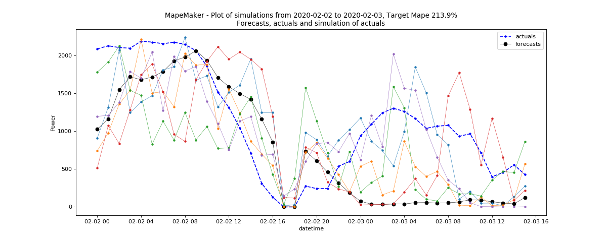

Using rts_gmlc data file as input for MapeMaker
===============================================
MapeMaker can be used with rts_gmlc data files found on their github website. The data files need to be
processed into the required 3 columns format - datetime, actuals, and forecasts.
We use "process_RTS_GMLC_data_s.py" file for this.
Here is a step-by-step explanation:

1. Git clone the rts_gmlc data files to your working directory. (The link might be updated, please modify it accordingly)

::

    git clone https://github.com/GridMod/RTS-GMLC.git

2. Now use the process_RTS_GMLC_data_s.py file to process the data in the required format for MapeMaker.
First, cd to the directory with the program:

::

    cd mape_maker/samples/rts_gmlc/

Then, you can run the python script as follows:

::

    python process_RTS_GMLC_data_s.py timeseries_path source_path write_path

where

* **timeseries_path**:
  location of the timeseries_data_files directory (e.g. "RTS-GMLC/RTS_Data/timeseries_data_files/")
* **source_path**:
  location of the SourceData directory (e.g. "RTS-GMLC/RTS_Data/SourceData/")
* **write_path**:
  location of an existing directory you want to store the processed files in (e.g. "my_rts_gmlc")

After running the python script, the write_path will contain all csv and txt files for all the timeseries data files processed by buses, zones, and aggregated together over all the zones.
The csv files can be used as input to MapeMaker to get the desired scenarios.

Here are some examples.

Example 1 - WIND_forecasts_actuals.csv
**************************************

The following command will take the data from *WIND_forecasts_actuals.csv*, and launch the
simulations with n = 5 and seed = 1234 from forecasts to actuals using an ARMA base process.
It will compute the distribution from 2020-2-1 00:00:00 to 2020-5-1 00:00:00 and simulate from
2020-2-2 00:00:00 to 2020-3-2 00:00:00. Finally, it will return a plot of simulations,
and create an output dir called "wind_forecasts_actuals".

::

    python -m mape_maker "mape_maker/samples/rts_gmlc/WIND_forecasts_actuals.csv" -st "actuals" -s 1234 -n 5 -bp "ARMA" -o "wind_forecasts_actuals" -is "2020-2-1 00:00:00" -ie "2020-5-1 00:00:00" -sd "2020-2-2 00:00:00" -ed "2020-3-2 00:00:00"

* **"mape_maker/samples/rts_gmlc/WIND_forecasts_actuals.csv"**:
 The csv file containing forecasts and actuals for specified datetimes.
* **-st "actuals"**:
 Set up the the target of the simulation as "actuals". So the MapeMaker will simulate the "actuals" data
 according to the "forecasts" data in the input file.
* **-n 5**:
 The number of simulations that we want to create is "5". This will create three simulation columns in the output file.
* **-bp "ARMA"**:
 Use "ARMA" as the base process.
* **-o "wind_forecasts_actuals"**:
 Create an output directory called "wind_forecasts_actuals" in the temporary subdirectory, in which will store the simulation output file.
 The program prints the temporary subdirectory in the temporary directory. The user can retrieve the output dir using that location.
* **-s 1234**:
 Set the seed as "1234", so it won't randomly choose a number as the seed.
* **-is "2020-2-1 00:00:00"**:
 The start date for the computation of the distributions is "2020-2-1 00:00:00"
* **-ie "2020-5-1 00:00:00"**:
 The end date for the computation of the distributions is "2020-5-1 00:00:00"
* **-sd "2020-2-2 00:00:00"**:
 The start date of the simulation is "2020-2-2 00:00:00"
* **-ed "2020-3-2 00:00:00"**:
 The end date of the simulation is "2020-3-2 00:00:00"

After running the command line, you should see a similar plot like this:

Example 2 - Bus_220_Load_zone2_forecasts_actuals.csv
*****************************************************

The following command will take the data from *Bus_220_Load_zone2_forecasts_actuals.csv*,
and launch the simulations with n = 5 and seed = 1234 from forecasts to actuals using an ARMA
base process. It will simulate all the dates in the input files. Finally, it will return a
plot of simulations, and create an output dir called "Bus_220_load".

::

    python -m mape_maker "mape_maker/samples/rts_gmlc/Bus_220_Load_zone2_forecasts_actuals.csv" -st "actuals" -n 5 -bp "ARMA" -is "2020-1-10 1:0:0" -ie "2020-7-20 0:0:0" -sd "2020-6-1 0:0:0" -ed "2020-6-30 23:0:0" -o "Bus_220_load" -s 1234

* **"mape_maker/samples/rts_gmlc/Bus_220_Load_zone2_forecasts_actuals.csv"**:
 The csv file containing forecasts and actuals for specified datetimes.
* **-st "actuals"**:
 Set up the the target of the simulation as "actuals". So the MapeMaker will simulate the "actuals" data
 according to the "forecasts" data in the input file.
* **-n 5**:
 The number of simulations that we want to create is "5". This will create three simulation columns in the output file.
* **-bp "ARMA"**:
 Use "ARMA" as the base process. The default base process is set as "ARMA".
* **-is "2020-1-10 1:0:0"**:
 The start date of the input data for processing is "2020-1-10 1:0:0"
* **-ie "2020-7-20 0:0:0"**:
 The end date of the input data for processing is "2020-7-20 0:0:0"
* **-sd "2020-6-1 0:0:0"**:
 The start date of the scenario simulation is "2020-6-1 0:0:0"
* **-ed "2020-6-30 23:0:0"**:
 The end date of the scenario simulation is "2020-6-1 0:0:0"
* **-o "Bus_220_load"**:
 Create an output directory called "Bus_220_load", in which will store the simulation output file.
* **-s 1234**:
 Set the seed as "1234", so it won't randomly choose a number as the seed.

After running the command line, you should see a similar plot like this:

.. figure::  ../_static/bus_220_load.png
   :align:   center

Since rts_gmlc Load data has very little relative error and hence very little mape,
the scenario lines tend to overlap in the plot.