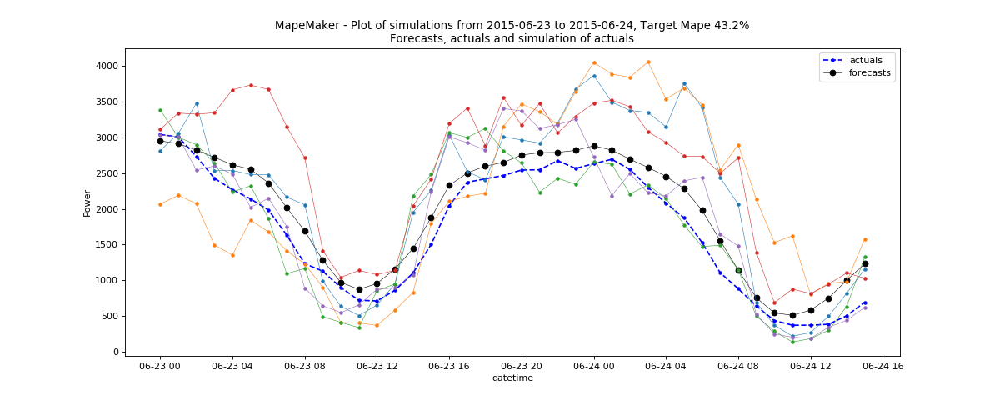

Second File Example
===================

**CAISO Wind and BPA data Examples**
---------------------------------

The user need to set the second file option when the file that he/she want to simulate is missing forecast/actual data.
The following command will take the input file *2012-2013_BPA_forecasts_actuals.csv* and the second file
*wind_total_forecast_actual_070113_063015.csv*. The second file will learn the error distribution from the input file, and
use it to create the simulation data. In order to fit the process well, we used a wild range of data for the input file.
In this example, we set the date range for the input file from "2012-6-3 00:00:00" to "2013-8-3 00:00:00 and generate
the scenarios from "2015-6-29 00:00:00" to "2015-6-30 00:00:00" for the second file.

::

    python -m mape_maker -xf "mape_maker/samples/2012-2013_BPA_forecasts_actuals.csv" -sf "mape_maker/samples/wind_total_forecast_actual_070113_063015.csv" -s 1234 -n 5 -o "BPA_Wind_1" -is "2012-6-3 00:00:00" -ie "2013-8-3 00:00:00" -ss "2015-6-23 00:00:00" -se "2015-6-30 00:00:00"

* **-xf "mape_maker/samples/2012-2013_BPA_forecasts_actuals.csv"**:
 The input file containing forecasts and actuals for specified datetimes.
* **-sf "mape_maker/samples/wind_total_forecast_actual_070113_063015.csv"**
 The second file containing forecasts and actuals for specified datetimes.
* **-n 5**:
 The number of simulations that we want to create is "3". This will create three simulation columns in the output file.
* **-bp "ARMA"**:
 Use "ARMA" as the base process. The default base process is set as "ARMA".
* **-is "2012-6-3 00:00:00"**:
 The start date for the computation of the distributions is "2012-6-3 00:00:00"
* **-ie "2013-8-3 00:00:00"**:
 The end date for the computation of the distributions is "2013-8-3 00:00:00"
* **-ss "2015-6-23 00:00:00"**:
 The start date of the simulation is "2015-6-23 00:00:00"
* **-se "2015-6-30 00:00:00"**:
 The end date of the simulation is "2015-6-30 00:00:00"
* **-o "BPA_Wind_1"**:
 Create an output directory called "BPA_Wind_1", in which will store the simulation output file.
* **-s 1234**:
 Set the seed as "1234", so it won't randomly choose a number as the seed.

After running the command line, you should see a similar plot like this:

