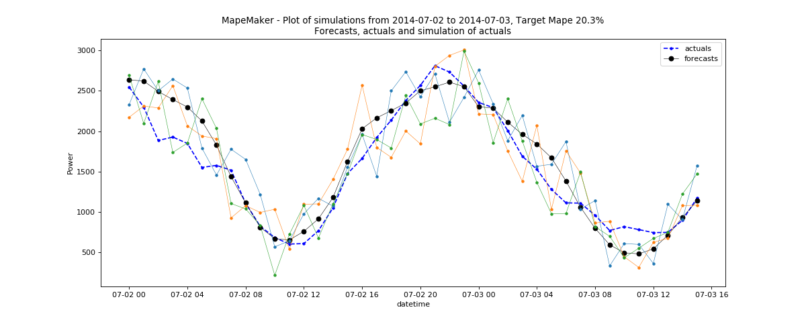
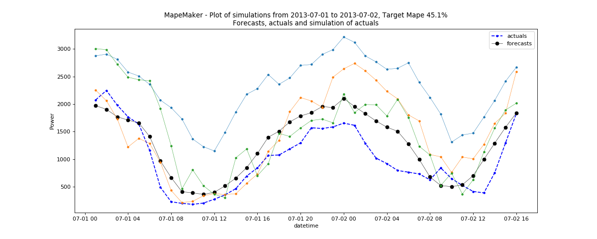

CAISO wind data file examples
=============================

**Sample Command 1:**

---------------------------------------------

The following command will take the data from *wind_total_forecast_actual_070113_063015.csv*,
and launch the simulations with n=3 and s=1234 from forecasts to actuals using an iid Base Process. It will
compute the distribution from 2014-7-1 00:00:00 to 2014-8-1 00:00:00 and simulate from
2014-7-2 00:00:00 to 2014-7-31 00:00:00. Finally, it will return a plot of simulations, and create
an output dir called "wind_actuals_iid" in your current working directory.

::

    python -m mape_maker "mape_maker/samples/wind_total_forecast_actual_070113_063015.csv" -st "actuals" -n 3 -bp "iid" -o "wind_actuals_iid" -is "2014-7-1 00:00:00" -ie "2014-8-1 00:00:00" -sd "2014-7-2 00:00:00" -ed "2014-7-31 00:00:00" -s 1234

* **"mape_maker/samples/wind_total_forecast_actual_070113_063015.csv"**:
 The csv file containing forecasts and actuals for specified datetimes.
* **-st "actuals"**:
 Set up the the target of the simulation as "actuals". So the MapeMaker will simulate the "actuals" data
 according to the "forecasts" data in the input file.
* **-n 3**:
 The number of simulations that we want to create is "3". This will create three simulation columns in the output file.
* **-bp "iid"**:
 Use "iid" as the base process. The default base process is set as "ARMA".
* **-is "2014-7-1 00:00:00"**:
 The start date for the computation of the distributions is "2014-7-1 00:00:00"
* **-ie "2014-8-1 00:00:00"**:
 The end date for the computation of the distributions is "2014-8-1 00:00:00"
* **-sd "2014-7-2 00:00:00"**:
 The start date of the simulation is "2014-7-2 00:00:00"
* **-ed "2014-7-31 00:00:00"**:
 The end date of the simulation is "2014-7-31 00:00:00"
* **-s 1234**:
 Set the seed as "1234", so it won't randomly choose a number as the seed.
* **-o "wind_actuals_iid"**:
 Create an output directory called "wind_actuals_iid", in which will store the simulation output file.

After running the command line, you should see a similar plot like this:

|
|
**Sample Command 2:**

---------------------------------------------

The following command will take the data from *wind_total_forecast_actual_070113_063015.csv*
, and launch the simulations with n=3 and seed=1234 from forecasts to actuals using an ARMA
Base Process. It will simulate all the dates in the input files. Finally, it will return a
plot of simulations, and create an output dir called "wind_actuals_ARMA".

::

    python -m mape_maker "mape_maker/samples/wind_total_forecast_actual_070113_063015.csv" -st "actuals" -n 3 -bp "ARMA" -o "wind_actuals_ARMA" -s 1234

* **"mape_maker/samples/wind_total_forecast_actual_070113_063015.csv"**:
 The csv file containing forecasts and actuals for specified datetimes.
* **-st "actuals"**:
 Set up the the target of the simulation as "actuals". So the MapeMaker will simulate the "actuals" data
 according to the "forecasts" data in the input file.
* **-n 3**:
 The number of simulations that we want to create is "3". This will create three simulation columns in the output file.
* **-bp "ARMA"**:
 Use "ARMA" as the base process.
* **-o "wind_actuals_ARMA"**:
 Create an output directory called "wind_actuals_ARMA", in which will store the simulation output file.
* **-s 1234**:
 Set the seed as "1234", so it won't randomly choose a number as the seed.

After running the command line, you should see a similar plot like this:

